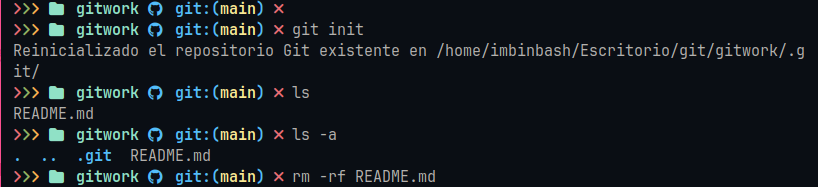
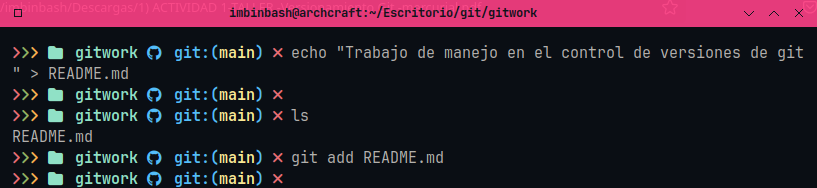
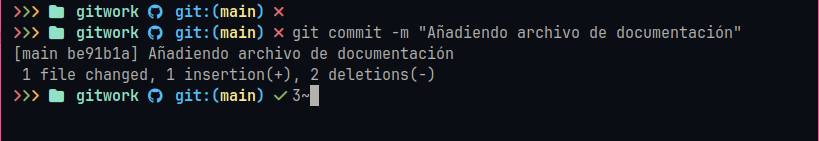
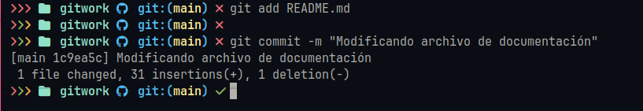
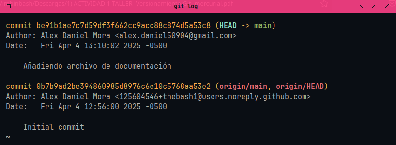
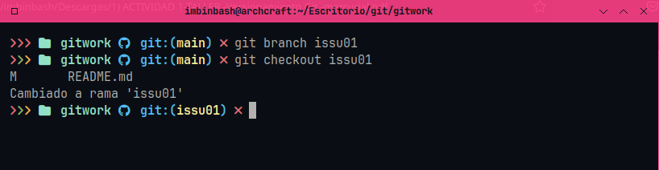
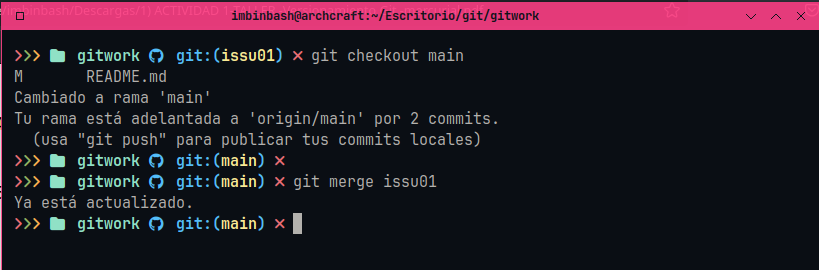

### Trabajo de manejo en el control de versiones de git  

**Punto 2**  
Abrir el terminal ejecutar git init  
  

**Punto 3**  
Crear un archivo con texto y añadirlo para un commit en camino  
  

**Punto 4**  
Realizar un commit  
  

**Punto 5**  
Hacer cambios en el archivo y agregar alguna linea nueva  
  

**Punto 6**  
Para leer el historial de commits, debemos buscar el "initial commit" (viene siendo el commit inicial), y de allí leer las fechas de creación de los demás commits.  
  

**Punto 7**  
Crear rama y cambiar de rama  
  

**Punto 8**  
Cambiar a la rama principal y fusionar cambios  
  

